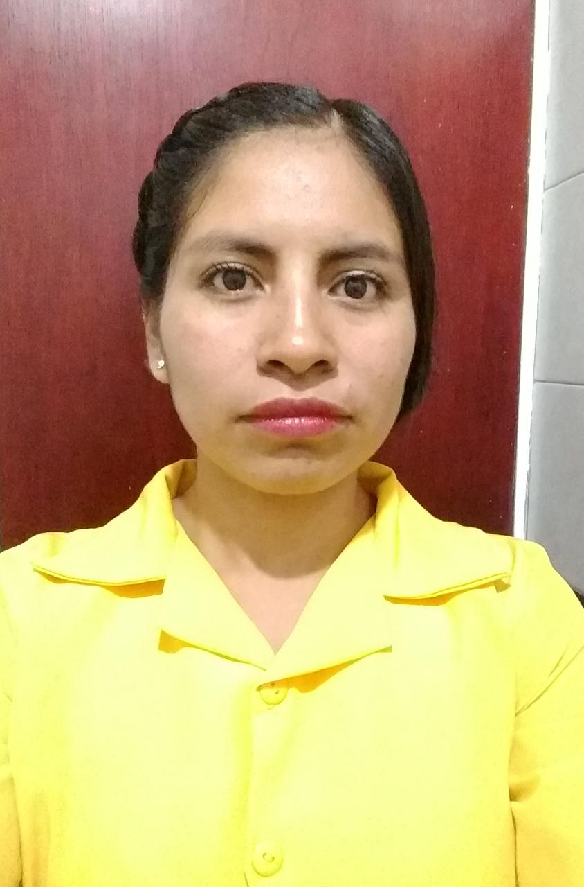

## Estudiantes

| ------ | ----------- |
|   | Título de tesis: Influencia de factores socio-ambientales en la incidencia de dengue: un modelo para Baja California Sur y un modelo general para la República Mexicana.
En la tesis se muestra la elaboración de modelos de regresión lineal simple y múltiple, con la técnica de mínimos cuadrados y el uso de coeficientes principales para predecir incidencia de dengue mediante factores socio-ambientales.
No hay límites para los sueños cuando la razón abraza la pasión y esta a la imaginación ... (Hermes)
Los sueños con perseverancia y dedicación se convierten en realidad, la realidad se estudia mediante modelos matemáticos, por eso, mi mayor interes es elaborar y diseñar modelos matemáticos para comprender esa realiad, además que sean utiles y benéficos para la sociedad. |
| engine | engine to be used for processing templates. Handlebars is the default. |
| ext    | extension to be used for dest files. |

